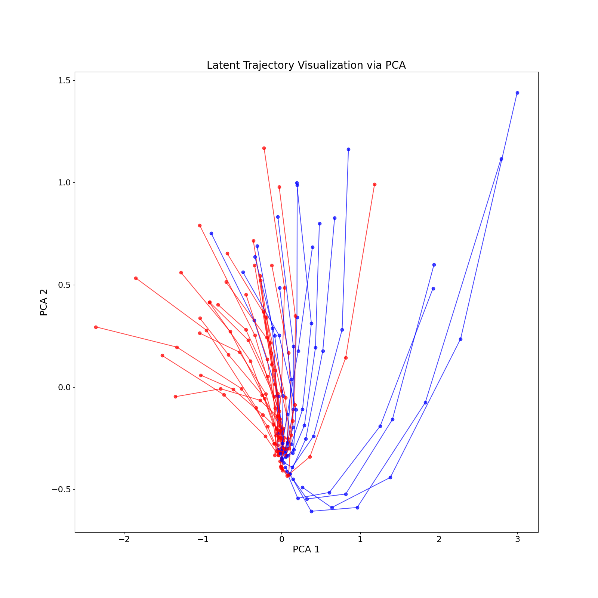
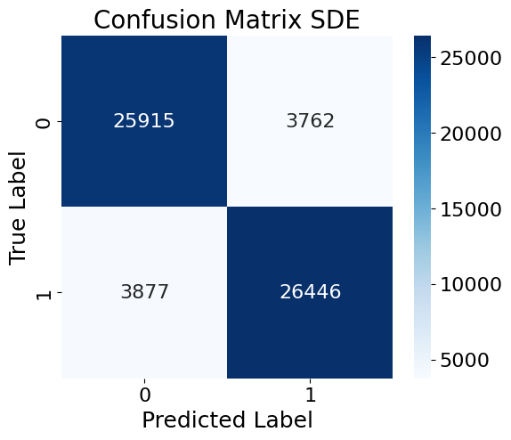
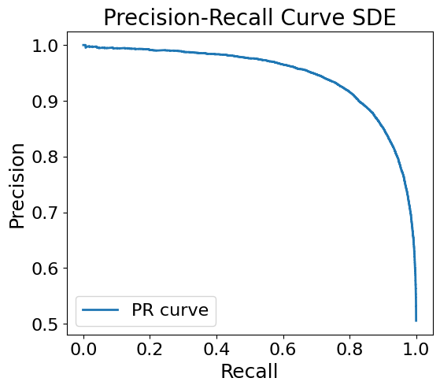
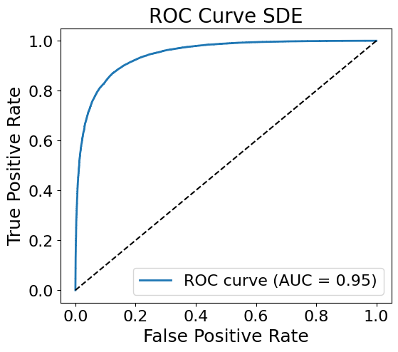

# Character-Level-Arabic-Sentiment-Classification-via-Neural-SDE-Based-Feature-Dynamics
Character-level Arabic sentiment analysis model combining CNNs with a continuous-time stochastic differential equation (SDE) layer. Trained on 330K reviews, it achieves 87.51% accuracy and strong macro-F1, performing competitively with transformer-based baselines like AraBERT.
## Dataset

This project uses the **330K Arabic Sentiment Reviews Dataset** by Abdalla Ellaithy on Kaggle.  
You can download it from:  
https://www.kaggle.com/datasets/abdallaellaithy/330k-arabic-sentiment-reviews

The main CSV file is about 67 MB and contains 330K Arabic product reviews labeled for sentiment (e.g., positive, negative). Please download the dataset from Kaggle and place it under the `data/` directory:

`data/330k-arabic-sentiment-reviews.csv`

  

  

  

  

